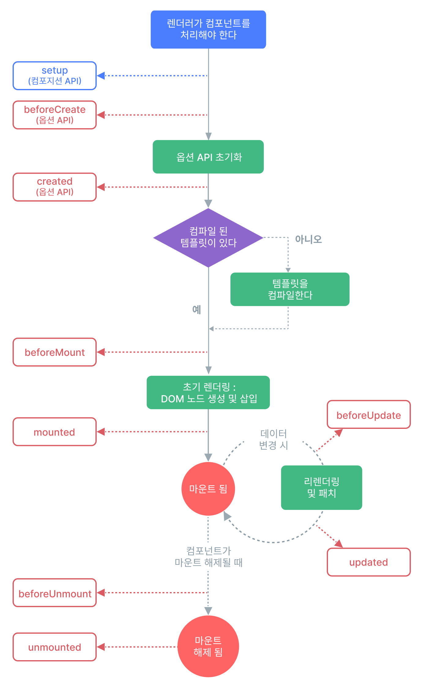

# 생명 주기 

각 Vue 컴포넌트 인스턴스는 생성될 때 일련의 초기화 단계를 거칩니다. 예를 들어, 데이터 감시를 설정하고, 템플릿을 컴파일하고, 인스턴스를 DOM에 마운트하고, 데이터가 변경되면 DOM을 업데이트해야 합니다. 

## beforeCreate
인스턴스가 초기화된 후 호출됩니다.

## created
인스턴스가 모든 상태 관련 옵션 처리를 완료한 후 호출됩니다.

반응형 데이터, 계산된 속성, 메서드 및 감시자가 설정된 후, 이 훅이 호출되면 됩니다.

## beforeMount
컴포넌트가 마운트되기 직전 호출됩니다.

## mounted
컴포넌트가 마운트된 후 호출됩니다.

## beforeUpdate
반응형 상태 변경에 의한 컴포넌트 DOM 트리 업데이트 직전 호출됩니다.

## updated
반응형 상태 변경에 의한 컴포넌트 DOM 트리 업데이트 후 호출됩니다.

부모 컴포넌트의 updated 훅은 자식 컴포넌트의 updated 훅 이후에 호출됩니다.

## beforeUnmount
컴포넌트 인스턴스가 마운트 해제되기 직전 호출됩니다.

## unmounted
컴포넌트가 마운트 해제된 후 호출됩니다.

## errorCaptured
자식 컴포넌트에서 전파된 에러가 캡쳐되었을 때 호출됩니다.

